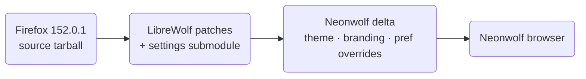

# Neonwolf

**Neonwolf** is a synthwave-themed, privacy-focused fork of Firefox, built as a
**thin overlay on [LibreWolf](https://librewolf.net)**. It takes a stock Firefox
release, runs LibreWolf's privacy/hardening patch pipeline, and layers on a small,
clearly-marked Neonwolf delta — a synthwave chrome theme, a glowing new-tab page,
and Neonwolf branding — to produce the Neonwolf browser.

Current base: **Firefox 152.0.1** (LibreWolf 152). Linux x86-64 is the supported
and tested target.

> This is a **patch-distribution repository**, not a copy of the browser source.
> It holds patches, branding, theme CSS, build config, and a Python orchestrator;
> the Firefox source tarball is downloaded and patched at build time.

## How it's built



The privacy/hardening baseline comes from the
[LibreWolf settings](https://codeberg.org/librewolf/settings) repo, tracked here
as the `settings/` git submodule. Neonwolf is a **capability-first heavy fork**:
it inherits LibreWolf's hardening for free, but **owned native features take
priority over merge convenience** — delta size is not a constraint. The deferred
native work (uBO-parity blocking, anti-fingerprint farbling, a per-site Shields
panel, binary-level surface stripping) is the product, not a footnote. We still
rebase onto LibreWolf each release to keep its fixes, accepting a heavier rebase;
the procedure lives in [`docs/REBASE.md`](docs/REBASE.md) and the roadmap in
[`PLAN_OF_ACTION.md`](PLAN_OF_ACTION.md).

## Download

Prebuilt Linux x86-64 builds are published on the
[Releases page](https://github.com/neon798/neonwolf/releases). Each release ships
a `.tar.xz` and a matching `.sha256sum`.

```sh
sha256sum -c neonwolf-152.0.1-1.en-US.linux-x86_64.tar.xz.sha256sum
tar xf neonwolf-152.0.1-1.en-US.linux-x86_64.tar.xz
LANG=en_US.UTF-8 MOZ_ENABLE_WAYLAND=1 ./neonwolf/neonwolf
```

(On X11 sessions, drop `MOZ_ENABLE_WAYLAND=1`. Setting `LANG` avoids a CJK locale
fallback.)

## Build from this repository

All targets go through `make`. Version is read from `./version` (`152.0.1`),
release from `./release` (`1`).

```sh
git clone --recursive https://github.com/neon798/neonwolf.git
cd neonwolf

make fetch        # download + gpg-verify the Firefox source tarball
make dir          # extract + apply all patches and the Neonwolf overlay
make bootstrap    # install build deps + ./mach bootstrap (one time)
make build        # ./mach build (takes a while)
make package      # produce the distributable .tar.xz in the repo root
# OR
make run          # build and launch
```

The patched tree is extracted to `neonwolf-{version}-{release}/`
(e.g. `neonwolf-152.0.1-1/`); the built binary lands at
`neonwolf-152.0.1-1/obj-x86_64-pc-linux-gnu/dist/bin/neonwolf`.

> **Resuming an interrupted build:** run `./mach build` **inside** the source
> tree, not `make build` — `make build` may re-extract and re-patch from scratch,
> wiping the `obj-*` directory.

### Validate patches without a full build

```sh
make check-patchfail   # confirm every patch applies cleanly to the FF tarball
```

This is what CI runs (GitHub Actions, `.github/workflows/check-patches.yml`),
pinned to the `./version` file. A full compile is not run in CI — it's too heavy
for hosted runners.

## Development

Architecture, conventions, and the critical build constraints are documented in
[`CLAUDE.md`](CLAUDE.md) — including how the synthwave theme is injected, the
new-tab CSS rules, the settings layering, and the pref-pane rebrand.

To work on a patch, edit inside the patched source tree and diff:

```sh
make dir
cd neonwolf-$(cat version)-$(cat release)
git init && git add <file> && git commit -qm initial
# ...make changes...
git diff > ../patches/my-change.patch
```

Patch application order is defined in `assets/patches.txt` and is load-bearing —
never reorder without re-running `make check-patchfail`.

## Credits

Neonwolf stands entirely on the work of others:

- **[LibreWolf](https://librewolf.net)** — the privacy/hardening patch set, build
  pipeline, and settings this overlay is built on.
- **[Mozilla Firefox](https://www.mozilla.org/firefox/)** — the underlying browser.

## License

Like Firefox and LibreWolf, Neonwolf is distributed under the
[Mozilla Public License 2.0](LICENSE).
